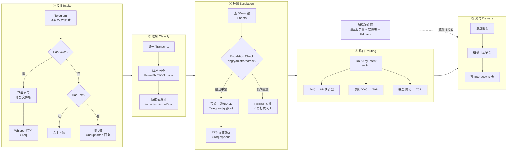

# docs/00-overview.md

## 流程总览：Triage Telegram voice and text support with Groq LLMs and Google Sheets

### 结论先行

这是一个**把 Telegram 上"语音 + 文字 + 脾气"全部接住的 AI 分级客服工作流**（示例业务：CBox 加密钱包客服）。40 个节点 = 8 个说明便签 + 32 个功能节点。它不追求"所有消息都用最强的 AI 答"，而是先**理解**再**分级**：

- **危险消息**（用户愤怒 / 疑似被盗）→ 立刻转人工 + 语音安抚，30 分钟内同一个人反复轰炸只处理一次；
- **普通消息** → 按意图分给**不同档位模型**：FAQ 用又快又便宜的 8B，安全 / 交易类用 70B 大模型仔细答；
- **全部交互**（含错误）留痕到 Google Sheets，出事可审计。

整个工作流可抽象成 **五段主链 + 一张错误兜底网**：

---

### ① 接收（Intake）：一条语音进来，先变成文字

| 项 | 说明 |
|---|---|
| **输入** | Telegram 任意消息（`telegramTrigger`：语音 / 文本 / 照片 / 贴纸…） |
| **处理** | 按消息类型三岔分流：语音 → 下载 + **修复文件名** + Groq Whisper 转写；文本 → 直读；其他 → 直接回复"暂不支持该类型" |
| **输出** | 统一字段 `transcript`（文本内容）+ `chatId` + 用户昵称 |
| **依赖凭证** | Telegram 客服 Bot、Groq API Key |

**语音链路为什么还要"修复文件名"？** Telegram 下载的音频文件经常没有扩展名或命名不规范，上传给 Whisper 时会因 MIME 识别失败而报错——一个专门的小 Code 节点负责把二进制数据归一到 `data` 键、补上 `.oga` 之类的扩展名。这类"外部服务格式洁癖"是真实世界里最常见的隐形杀手。

### ② 理解（Classify）：让模型先表态，再决定怎么办

| 项 | 说明 |
|---|---|
| **输入** | 统一 transcript + 用户上下文 |
| **处理** | llama-3.1-8b-instant + `response_format: json_object` 强制输出 JSON：`intent`（5 类）/ `sentiment`（3 档）/ `security_risk`（布尔）/ `confidence`（0~1） |
| **输出** | 解析后的分类对象（含原始字段透传） |
| **依赖凭证** | Groq API Key |

**教学精华在"解析"而不在"调用"**：LLM 可能返回 markdown 围栏、给字符串 `"true"`、甚至夹带废话。`Parse Classification JSON` 节点做四件套防御：清洗围栏 → 提取 JSON → 失败静默回退 `faq/neutral/false` → 真值 `!!` 归一。**任何一步偷懒，下游全断**——这课专门有一个错误场景演示"分类抛错后用户会收到什么"。

### ③ 升级（Escalation）：危险信号 → 人进来 + 语音安抚

| 项 | 说明 |
|---|---|
| **触发条件** | `Escalation Check`：sentiment 为 `angry` / `frustrated` **或** `security_risk=true`（用户说"我钱包被盗了"哪怕语气平静也升级） |
| **处理** | ① Sheets 写升级锁（chatId + 时间戳）→ ② 内部通知 bot 给人工发 **SECURITY RISK 标记 + 转写原文** → ③ Groq TTS（orpheus）合成语音安抚发给用户 |
| **防轰炸** | 30 分钟窗口：锁内同一个人再发消息 → 只收 `Holding Reply`（"专家已在处理"），**不重复通知人工** |
| **依赖凭证** | Telegram 内部 Bot（第 2 个）、Groq API Key、Google Sheets |

**先查锁、再升级**是本段的关键顺序：`Get row(s) in sheet → Evaluate Escalation Lock → Already Escalated?`。⚠️ 这里藏着模板的第一个真实 bug——**空表会导致整条升级链静默断掉**（详见 docs/03，mock 实测踩中）。

### ④ 路由（Routing）：按意图分配"不同身价"的模型

| 项 | 说明 |
|---|---|
| **输入** | 分类结果（intent ∈ faq / transaction_issue / account_kyc / wallet_security / trading_swap） |
| **处理** | `switch` 分流：FAQ → **llama-3.1-8b-instant**（max_tokens 200，快而省）；Transaction/KYC、Security/Trading → **llama-3.3-70b-versatile**（强而稳） |
| **输出** | AI 回复文本（从 OpenAI 兼容响应里提取 `choices[0].message.content`） |
| **依赖凭证** | Groq API Key（同一个 key，只换 model 名） |

同一个 `chat/completions` 端点、同一份 prompt 骨架，**换 model 名就是换成本档位**。FAQ 一天问一万次用 8B，安全类一小时三条用 70B——这就是分级客服的算力经济学。

### ⑤ 交付（Delivery）+ 错误兜底网

正常路径：回复发给用户 → `Prepare Log Data` 组装（escalated 标志 / 回复文案 / 时间戳）→ 写 `Interactions` 表。

任何转写 / 分类 / 回复 / TTS 节点出错 → **错误网三连**：Slack 告警（含失败节点名 + 错误信息）→ 错误表留痕 → 给用户发友好兜底回复。兜底回复怎么知道发给谁？靠 **chatId 四级回退链**：解析结果 → 语音转写结果 → 文本转写结果 → 触发器原始 chat.id，逐级找。

⚠️ 这段也有模板的第二个真实 bug（**日志列映射错位**）和第三个（**错误网有盲区，Telegram 发送节点裸奔**），详见 docs/05——它们是我们用 mock 断言实锤抓出来的，比"照着模板抄"值钱得多。

---

## 凭证映射表

| 服务 | 用途 | 需要配置的凭证项 | 备注 |
|---|---|---|---|
| **Telegram（客服 Bot）** | 接收用户消息 + 发回复 / 安抚语音 | BotFather `/newbot` 拿 Token | 用户能直接搜到、发起对话的那个号 |
| **Telegram（内部通知 Bot）** | `Notify Human Agent` 给人工发升级提醒 | 第二个 BotFather Token | 模板注释建议用"账号 2"，人工侧单独收信 |
| **Groq** | Whisper 转写 + 4 个 LLM + TTS 语音合成 | 一个 `groqApi` key 全局共用 | https://console.groq.com 免费注册；所有 HTTP 节点共用 |
| **Google Sheets** | 升级锁表 + Interactions 日志 + Errors 错误表 | OAuth2 凭据 + Spreadsheet ID | 建议一张表三个 sheet：`Escalations` / `Interactions` / `Errors` |
| **Slack** | 错误告警推送 | Bot Token + Channel ID | 可选；教学可用飞书群 / 钉钉群机器人等价替换 |

> ⚠️ **Whisper 转写接口不是 chat/completions**：Groq 的转写走 `/audio/transcriptions`（multipart 上传音频文件），语音合成走 `/audio/speech`，只有 4 个"文字对话"节点走 `/chat/completions`。三种接口 URL 不同，别改错。

---

## 坑点提示：为什么这课值得把"验证"当第一主题？

作者写模板时踩过的坑，我们 L2 阶段**全部复现并修掉了**，它们是本课最好的教材：

1. **上游 0 项输出 → 下游静默不跑**（n8n 最大隐形杀手）：查锁表为空 → 后续升级链整体静默断掉，用户被无视。
2. **官方模板的字段映射 bug**：日志表把 `intent` 列写成 sentiment 的值、`userName` 列写成 transcript——模板不等于真理。
3. **错误网盲区**：只罩住"生成内容"的节点，最后发消息的 Telegram 节点裸奔——最后一公里断了没人知道。
4. **Code 沙箱安全模型**：n8n task-runner 默认禁止 `fs`，要用文件必须自声明并放行内置模块。

> 💡 **一句话总结**：这课的产出不止"一个能跑的客服流"，更是"一套把任何 n8n 模板快速验真、拆解、改造的方法论"——32 项单元断言 + 42 项场景断言就是你的照妖镜。